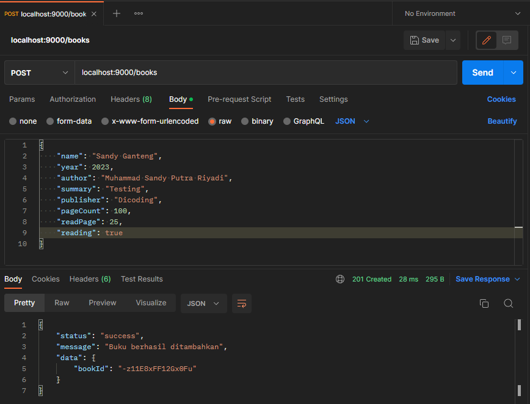

# Bookshelf API
Proyek Bookshelf API untuk Submission Dicoding Belajar Membuat Aplikasi Back-End untuk Pemula dengan Google Cloud by [@msandypr](https://msandypr.com). `UPDATED AT 17/03/2023 03:38`

## Step yang saya lakukan
1.Pertama-tama saya clone repository ini dan saya menginisialisasi project Bookshelf API ini dengan command :
```sh
npm init --y
```
2.Lalu, saya menggunakan beberapa packages untuk membantu proses development ini, antara lain :
- [Hapi Framework](https://hapi.dev/)
- [Nodemon](https://nodemon.io/)

Nodemon ini saya gunakan hanya untuk proses development.

3.Setelah itu, saya membuat folder 'src' dan menambahkan file 'server.js', yang berfungsi untuk menjalankan server localhost.

4.Setelah itu, saya menambahkan file 'routes.js' untuk testing saja apakah server kita secara localhost berjalan atau tidak.


5.Setelah itu, saya membuat file 'books.js', berfungsi untuk menyimpan data dalam bentuk array, dan membuat file 'handler.js' yang berfungsi untuk membuat fungsi seperti CRUD.

6.Saya menginstall package nanoid yang berfungsi untuk generate id secara unique untuk data - data buku.
- [Nano ID](https://github.com/ai/nanoid#readme).

7.Saya membuat fungsi 'addBookHandler' untuk create data buku baru dan mencoba testing fungsinya.



8.Saya membuat fungsi 'getAllBookHandler' dan 'getBookByIdHandler' untuk get/read data buku.

9.Saya membuat fungsi 'editBookByIdHandler' untuk edit/put data buku.

10.Saya membuat fungsi 'deleteBookByIdHandler' untuk hapus/delete data buku.

## Testing
1.[MANDATORY]Add Book With Complete Data


2.[MANDATORY]Add Book With Finished Reading


3.[MANDATORY]Add Book Without Name


4.[MANDATORY]Add Book With Page Read More Than Page Count


5.[MANDATORY]Get All Books


6.[MANDATORY]Get Detail Books With Correct Id, Terdapat Error book object should contain correct property and value | AssertionError: expected 'Saya Sedang Patah Hati' to equal 'Buku A'.


7.[MANDATORY]Get Detail Finished Book, Terdapat Error yang sama dengan Test ke-6, yaitu : book object should contain correct property and value | AssertionError: expected 'Saya Sedang Patah Hati' to equal 'Buku A'.


8.[MANDATORY]Get Detail Books With Invalid Id


9.[MANDATORY]Update Book With Complete Data


10.[MANDATORY]Update Book Without Name


11.[MANDATORY]Update Book With Page Read More Than Page Count


12.[MANDATORY]Update Book With Invalid Id


13.[MANDATORY]Delete Book With Correct Id


14.[MANDATORY]Delete Finished Book


14.[MANDATORY]Delete Finished Book


15.[MANDATORY]Delete Book With Invalid Id


